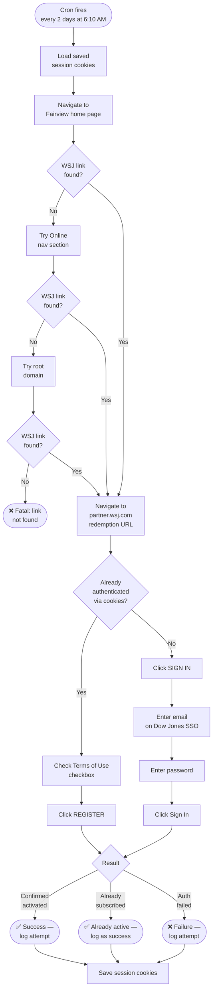

# wsj-auto-redeem

Automates the Fairview Free Public Library's WSJ subscription redemption. The library posts a new redemption code every 72 hours via a public link on their website. This script fetches that link, navigates the WSJ partner portal, and activates your subscription automatically — running every 2 days inside Docker to maintain continuous access.

## How It Works



## Setup

### 1. Prerequisites

- Docker installed and running
- A WSJ account (free to create at wsj.com)
- Fairview Library card number and PIN

### 2. Clone and configure

```bash
git clone git@github.com:rawhideron/wsj-auto-redeem.git
cd wsj-auto-redeem
```

Edit `.env` with your credentials (see variables below).

### 3. Environment variables

| Variable | Required | Description |
| --- | --- | --- |
| `WSJ_EMAIL` | Yes | Your WSJ account email |
| `WSJ_PASSWORD` | Yes* | Your WSJ password |
| `LIBRARY_CARD_NUMBER` | No | Fairview library card (not required for WSJ flow) |
| `LIBRARY_PIN` | No | Fairview library PIN |
| `COOKIE_ENCRYPTION_KEY` | No | AES-256-GCM key for encrypting saved cookies |
| `CHROME_EXECUTABLE_PATH` | No | Path to Chrome binary (auto-detected in Docker) |
| `FAIRVIEW_HOME_URL` | No | Defaults to `https://fairviewlibrarynj.org/en/` |
| `TZ` | No | Timezone for cron (default: `America/New_York`) |

*Password only needed if session cookies have expired.

### 4. First-time login (capture session cookies)

The script uses saved cookies so it rarely needs your password. Run manual mode once to capture a session:

```bash
# On the host machine (requires Chrome installed)
export $(grep -v '^#' .env | xargs)
node redeem.js --manual
```

A Chrome window opens at the WSJ login page. Log in by hand, then press **Ctrl+C**. Your session is saved to `cookies/wsj-cookies.json` and reused on every subsequent run.

### 5. Deploy

```bash
docker build -t wsj-redeem .
docker run -d \
  --name wsj-redeem \
  --restart unless-stopped \
  -v "$(pwd)/cookies:/app/cookies" \
  --env-file .env \
  -e TZ=America/New_York \
  wsj-redeem
```

## Schedule

The cron job runs at **6:10 AM every 2 days** (`10 6 */2 * *`), giving a 24-hour buffer before the 72-hour code expires. If the subscription is already active when the job fires, it logs a success and moves on — no duplicate charges or errors.

## Monitoring

```bash
# Live log stream
docker logs -f wsj-redeem

# Redemption history (last 30 attempts)
cat cookies/history.json

# Manual test run inside the container
docker exec wsj-redeem bash -c \
  ". /app/.env-cron && xvfb-run -a node /app/redeem.js"
```

## Cookie expiry

If the script starts failing with auth errors, the session cookies have expired. Re-run manual mode to refresh them:

```bash
node redeem.js --manual
```

## Relationship to nytimes-auto-redeem

This project is a sibling to [nytimes-auto-redeem](https://github.com/rawhideron/nytimes-auto-redeem). Both automate Fairview Library digital subscriptions using the same puppeteer-real-browser stack. The NYTimes job runs at 6:05 AM daily; this one runs at 6:10 AM every 2 days to avoid overlap.
